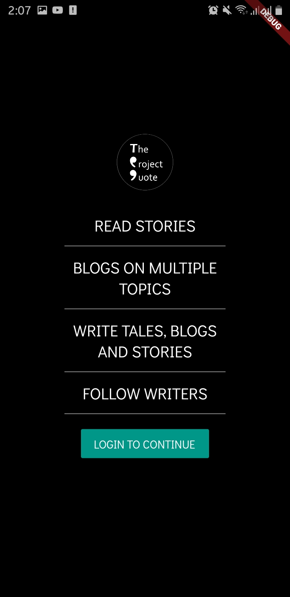
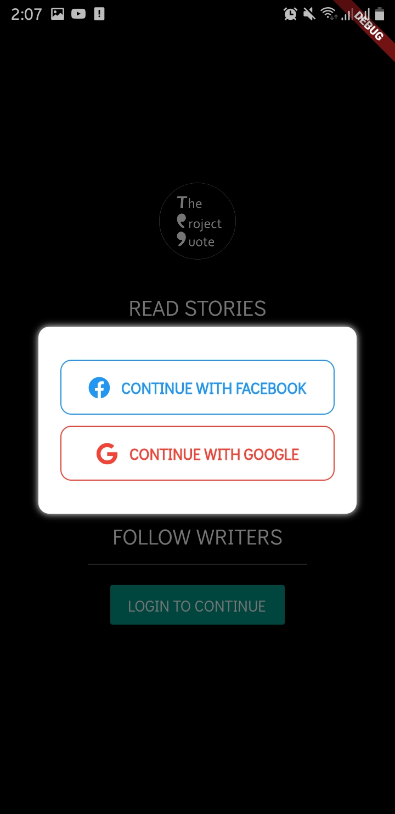
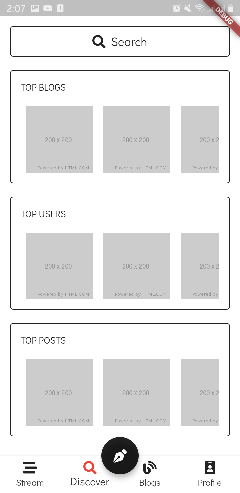
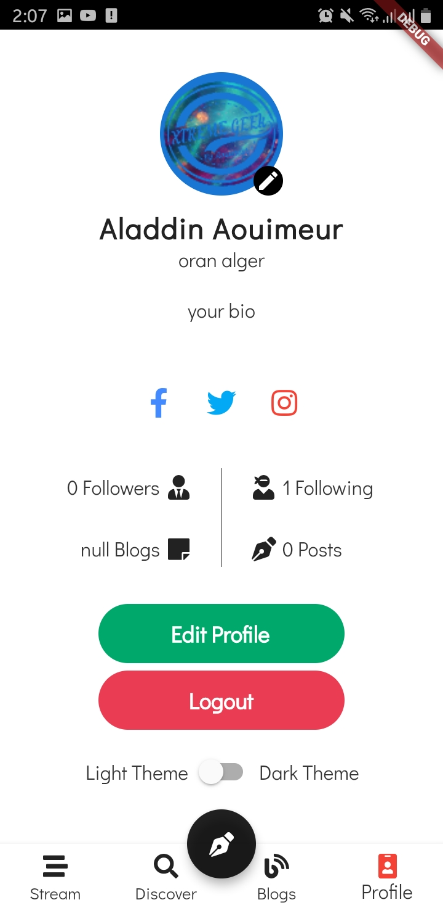
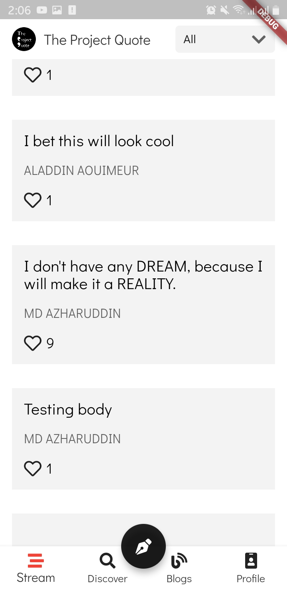
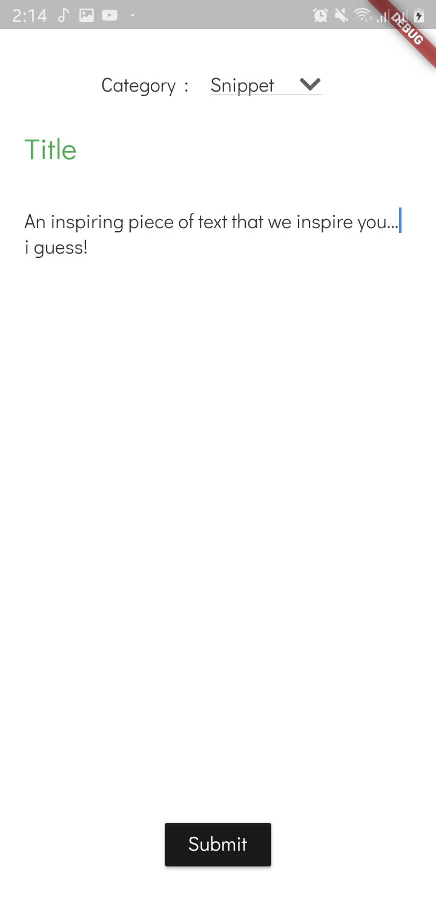
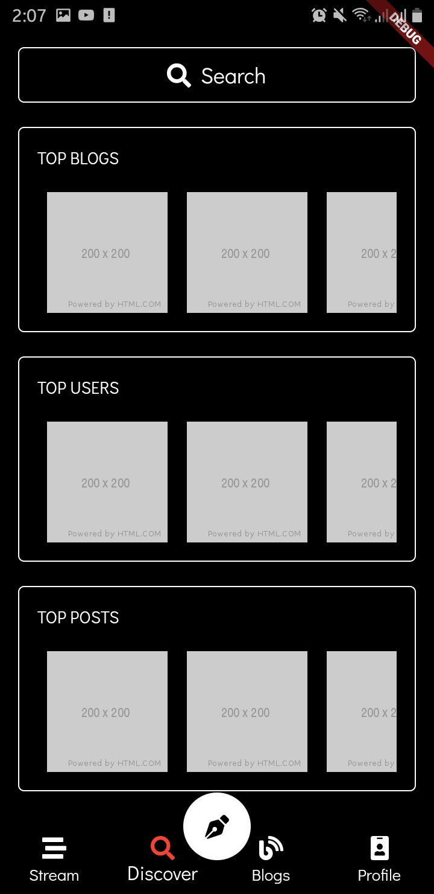
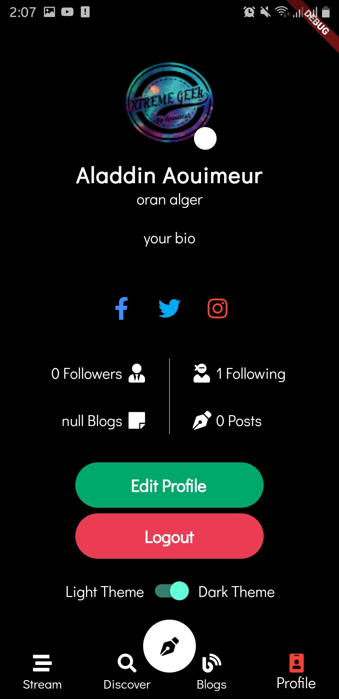
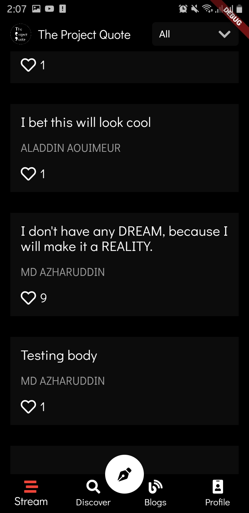

<h1 align="center">
   
  
   
  TPQ - Make Your Thoughts heard 
   
</h1>

<h4 align="center">An app for writers made using <a href="https://flutter.dev" target="_blank">Flutter</a>.</h4>

  

  <a href="#key-features">Key Features</a> •
  <a href="#how-to-use">How To Use</a> •
  

<h4 align="center">White Theme</h4>

    
  
  
  
  
   

<h4 align="center">Dark Theme</h4>

  
   
  
  
  
  
   

## Key Features

* Write blogs,quotes and snippets
* Follow users and read there latest texts
* Like and upvote the best quotes so that they appear to every user
* Dynamic theming **Dark/White** themes
* Google and Facebook **authentification**
* New Users welcome screen  

## How To Use

To clone and run this application, you'll need [Git](https://git-scm.com) and [Flutter](https://flutter.dev/docs/get-started/install) installed on your computer. From your command line:

> GitHub [@alaaedaouimeur](https://github.com/sabinbajracharya) &nbsp;&middot;&nbsp;
> Instagram [@x.alaaaouimeur.x](https://www.instagram.com/x.alaaaouimeur.x/)
